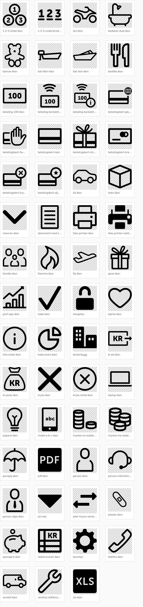

# Felles Front End Icons

This is a repository for sharing icon SVGs between projects. When your project produces a new icon,
please add it to ffe-icons so other teams can make use of it.

ffe-icons will build an SVG sprite with all icons and put it in `dist/symbol/`, along with an HTML page where
the different icons can be viewed. **This file should in most cases not be used directly!**

Instead, ffe-icons should be used as a repository from where your build fetches only the icons that it needs, to keep
the sprite file size as low as possible. Read on to see how you can set up your build to do this.

## Available icons


## Including ffe-icons in your app
First add an `icons.json` file to your project where you define what icons you want. Additionally, you can
pass in options that [svg-sprite](https://github.com/jkphl/svg-sprite) support to override defaults.

Example `icons.json`:

```

{
    "dest": "app/",
    "icons": [
        "1-2-3-sirkel-ikon",
        "bamse-ikon",
        "dor-ikon",
        "flamme-ikon",
        "logo-sparebank1",
        "twitter-ikon"
    ],
    "config": {
        "log": "error",
        "mode": {
            "symbol": {
                "sprite": "awesome-icons.svg"
            }
        }
    }
}

```

To have npm be able to find the gulp dependency of ffe-icons in node_modules gulp has to be started from npm.
In your projects `package.json`:

```
{
    "name": "awesome-client",
    "scripts": {
        ...
        "ffe:icons": "gulp --no-color --gulpfile node_modules/ffe-icons/gulpfile.js --opts=../../icons.json",
        "#": "--gulpfile sets the cwd to be the dir containing the gulpfile, so --opts has to step up two dirs to find icons.json"
        ...
    }
}
```

Then, in your terminal:

`$ npm run ffe:icons`

A fresh SVG sprite should now have arrived at your destination.

Note: **it is recommended that you _not_ check the generated sprite into source control, but instead let ffe-icons
generate it at build-time.** This reduces the number of manual build steps, and keeps you up-to-date.

## Using the ffe-icons sprite

The primary color (royal blue) is removed from the SVG. This is so CSS can be used to override the color. To re-instate
royal blue as the primary color, add the following to your global icon class:

```
.icon {
    fill: "#002776"; // Or, even better:
    fill: @blue-royal; // assuming use and import of ffe-core variables

    // To add alternatives, replace the fill attribute with whatever color you need
    &--white {
       fill: #fff;
    }
    &--black {
       fill: #000;
    }
}
```

Non-royal blue colors are left as-is, so details in other colors are left untouched.

In your markup:

```
<svg class="icon">
    <use xmlns:xlink="http://www.w3.org/1999/xlink"
         xlink:href="/app/symbol/ffe-icons.svg#person-ikon"></use>
    <!-- <desc>Alt text goes here</desc> -->
</svg>
```

Finally, depending on the current state of browsers and support requirements you may need to include the
[SVG for Everybody](https://github.com/jonathantneal/svg4everybody) shim in your app.

## Known issues

See the current status on browser support for SVG fragments on [caniuse.com](caniuse.com/svg-fragment).

* At time of writing, the generated SVG sprite cannot be used as a source for `background-image` in your CSS like "single" SVGs can


## Adding a new icon to ffe-icons

When your project produces a new icon, please add it to ffe-icons as a minor update to the current main version so other teams
can make use of it. To do that, follow the steps described below. Ask around in the HipChat room Alliansens Frontend-forum
if you get stuck.

Also before starting, verify your SVG meets the criteria listed in *icons/_ICON_REQUIREMENTS.md*

1. Fetch the latest `master` branch in ffe-icons, and create a feature branch from there.
2. Clean up the SVG markup [^3].
3. Add the icon SVG to the `icons/` folder [^1].
4. Verify that the icon looks OK relative to the others (padding etc) [^2].
5. Update `CHANGELOG.md` with a new entry for the next version.
6. Update package.json with the new version
7. Update the baseline-screenshot so the visual regression testing doesn't fail (see below)
8. Commit your changes to the feature branch, and push the changes to `origin`.
9. Make sure you have at least one successful build on jenkins (feature branches are built automatically)
10. Create a pull request from your repos feature branch to ffe-icons `master`.

## Visual regression testing
See [readme for ffe-core](https://stash.intern.sparebank1.no/projects/FFE/repos/ffe-core/browse/README.md).

## Pull Requests
See [readme for ffe-core](https://stash.intern.sparebank1.no/projects/FFE/repos/ffe-core/browse/README.md).

## Publishing
See [readme for ffe-core](https://stash.intern.sparebank1.no/projects/FFE/repos/ffe-core/browse/README.md).


###### Footnotes

[^1]: Give the icon a name that describes _what it is_, **not** what it will be _used for_ (since that may be different
from app to app). I.e., call it flamme-ikon, not skade-ikon even though it might represent skadeforsikring in your app.

[^2]: Run `$ npm start`, open the generated HTML (`dist/symbol/sprite.symbol.html`) and have a look. If only minor edits
are needed (padding for instance) you can try this [web-based SVG editor](https://github.com/SVG-Edit/svgedit).

[^3]:
Example using Inkscape:
1. Open the SVG file in Inkscape
2. SHIFT-CTRL-D Change the width and height to 200.
3. CTRL-A Select all elements.
4. SHIFT-CTRLl-G Remove groups, (<g> elements). Repeat until no more groups.
5. CTRL-A and CTRL-'+' (Union) - Convert all elements to a single path. This may make the icon larger if the path is very complex.
6. SHIFT-CTRL-M  Scale the icon until it fills the view box (vertical or horizontal)
7. SHIFT-CTRL-S Save the icon as Optimized SVG
8. Open the Icon in a text editor and check if it contains any transform attributes. If not, jump to 10.
9. Open the icon in http://editor.method.ac/ CTRL-A and choose Object->Reorient Path - This usually removes transforms. Save the file to disk.
10. Remove all metadata og unnecessary whitespace. The structure of the .svg file should be <svg viewBox="0 0 200 200" xmln"..."><path d="..."/></svg>
