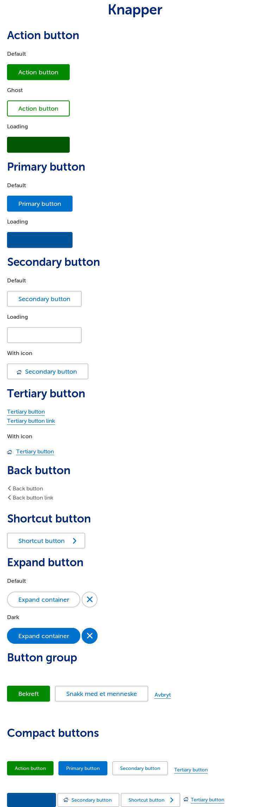

# ffe-buttons

Pakken inneholder stylingen for de ulike knappene som er i FFE. Generelt, om en komponent heter _noe_-button ligger den her.

* ffe-action-button
* ffe-expand-button
* ffe-primary-button
* ffe-secondary-button
* ffe-shortcut-button
* ffe-tertiary-button

## Bruk

ffe-buttons har en peerDependency på ffe-core. Installer begge for å bruke ffe-buttons.

```sudo a
$ npm install --save-dev ffe-core ffe-buttons
```

ffe-buttons brukes på samme måte som ffe-core. Importer `ffe-buttons/less/buttons.less` for å ta i bruk alle knappene.

## Migrering fra ffe-core 7.x

`.ffe-button-group` er fjernet, siden den la føringer for layout som ikke alltid stemte overens med behovene.
Om du er havengig av `.ffe-button-group` kan du selv legge den til i prosjektet ditt.
[Koden finnes fremdeles her](***REMOVED***#less/components/button-group.less)

## Utvikling

For å teste endringer i en reell app lokalt kan man kjøre i dette prosjektes mappe:

```
sudo npm link
```

Og i prosjektet som skal bruke endringene gjort lokalt kan man kjøre:

```
npm link ffe-buttons
```

Når endringene dine er gjort må du oppdatere de visuelle regresjonstestene. Dette krever at Docker og
[Gemini](https://github.com/gemini-testing/gemini) er installert på din maskin:

```
./update_visual_regression_test_baseline.sh
```

Verifiser ved å kjøre testene:

```
./run_visual_regression_test.sh
```

Commit endringene med oppdaterte baselines og lag en pull request.

## Screenshot

