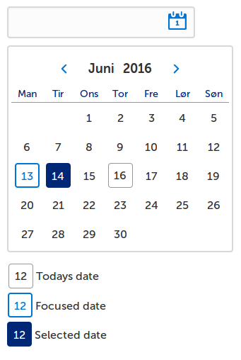

# ffe-datepicker

This package contains styles for the ffe-datepicker.



## Install

```
$ npm install --save ffe-datepicker
```
To test changes locally, you can run the following command in the projects directory:
```
sudo npm link
```
And in the project which will use the files you change, you must run:
```
npm link ffe-datepicker
```

## Usage
The styles for this package can be used in 3 different ways depending on what you want.
For All styles or Only date input you will need the `ffe-form` package in your project.

### All styles
You need styles for both the dateinput field and the calendar.
```css
@import "node_modules/ffe-datepicker/less/datepicker.less";
@import "node_modules/ffe-form/less/form.less";
```
Example HTML stucture with classes. (Aria-tags and other attributes have been removed for clarity)
```html
<div class="ffe-datepicker">
    <!-- see dateinput section below -->
    <!-- see calendar section below -->
</div>
```

### Only date input styles
```css
@import "node_modules/ffe-datepicker/less/dateinput.less";
@import "node_modules/ffe-form/less/form.less";
```
Example HTML stucture with classes. (Aria-tags and other attributes have been removed for clarity)
```html
<div class="ffe-dateinput">
    <input class="ffe-dateinput__field ffe-input-field" type="text">
    <svg class="ffe-dateinput__icon">
        <path .../>
    </svg>
</div>
```

### Only the calendar styles
```css
@import "node_modules/ffe-datepicker/less/calendar.less";
```
Example HTML stucture with classes. (Aria-tags and other attributes have been removed for clarity)
```html
<div class="ffe-calendar ffe-calendar--datepicker">
    <div class="ffe-calendar__header">
        <div class="ffe-calendar__header-inner-wrapper">
            <button class="ffe-calendar__month-nav ffe-calendar__previous">
                <svg class="ffe-calendar__icon-prev">
                    <path .../>
                </svg>
            </button>
            <header class="ffe-calendar__title">
                <div id="ffe-calendar-499__month-label">
                    <span class="ffe-calendar__month">Juni</span>
                    <span class="ffe-calendar__year">2016</span>
                </div>
            </header>
            <button class="ffe-calendar__month-nav ffe-calendar__next">
                <svg class="ffe-calendar__icon-next">
                    <path .../>
                </svg>
            </button>
        </div>
    </div>
    <table class="ffe-calendar__grid">
        <thead>
            <tr>
                <th class="ffe-calendar__weekday">
                    <span>Man</span>
                </th>
                <th class="ffe-calendar__weekday">
                    <span>Tir</span>
                </th>
                <th class="ffe-calendar__weekday">
                    <span>Ons</span>
                </th>
                <th class="ffe-calendar__weekday">
                    <span>Tor</span>
                </th>
                <th class="ffe-calendar__weekday">
                    <span>Fre</span>
                </th>
                <th class="ffe-calendar__weekday">
                    <span>Lør</span>
                </th>
                <th class="ffe-calendar__weekday">
                    <span>Søn</span>
                </th>
            </tr>
        </thead>
        <tbody>
            <tr>
                <td class="ffe-calendar__day">
                    <span class="ffe-calendar__date">1</span>
                </td>
                <td class="ffe-calendar__day">
                    <span class="ffe-calendar__date">2</span>
                </td>
                <td class="ffe-calendar__day">
                    <span class="ffe-calendar__date">3</span>
                </td>
                <td class="ffe-calendar__day">
                    <span class="ffe-calendar__date">4</span>
                </td>
                <td class="ffe-calendar__day">
                    <span class="ffe-calendar__date">5</span>
                </td>
                <td class="ffe-calendar__day">
                    <span class="ffe-calendar__date">6</span>
                </td>
                <td class="ffe-calendar__day">
                    <span class="ffe-calendar__date">7</span>
                </td>
            </tr>
            <tr>
                ... More td
            </tr>
            <tr>
                ... More td
            </tr>
            <tr>
                ... More td
            </tr>
            <tr>
                ... More td
            </tr>
        </tbody>
    </table>
</div>
```
