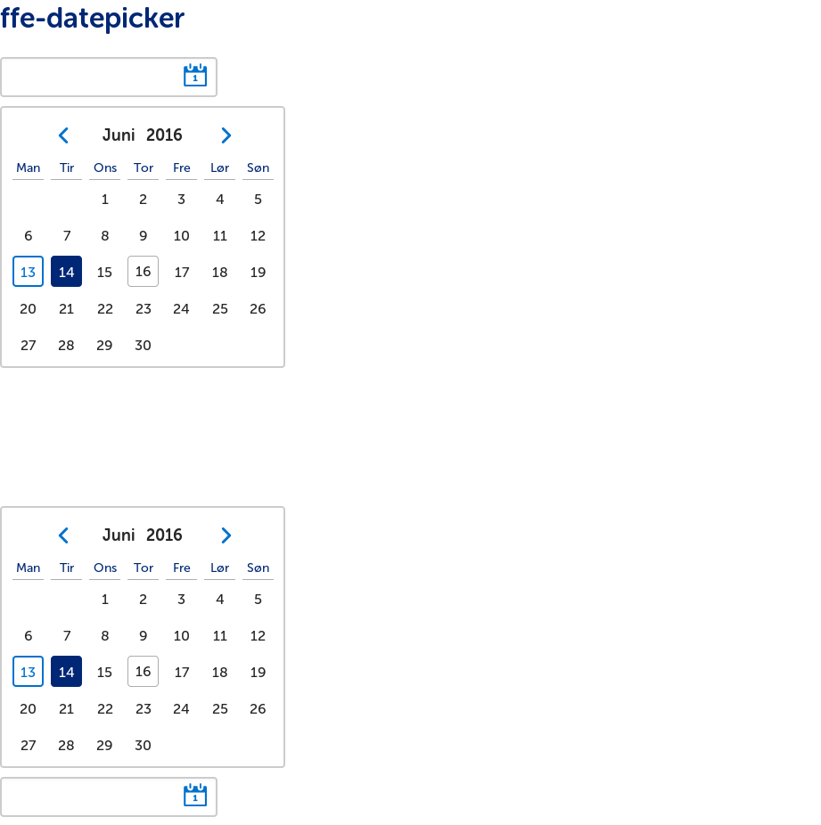

# ffe-tables

Pakken inneholder styling til ffe-tables

## Bruke
ffe-tables har en peerDependency på `ffe-core`

```
$ npm install --save-dev ffe-core ffe-tables
```
ffe-tables brukes på samme måte som ffe-core. Importer `ffe-tables/less/tables.less` for å ta i bruk alle listene.

Ta en titt i [example-filen](example/example.html) for markup og [less-filen](less/responsive-table.less) for
tilgjengelige klasser og modifiers.

## Bruk klassenavn på `.ffe-responsive-table` sine children!
Fra og med versjon 3.0.0 er styling direkte på DOM-struktur fjernet. Med andre ord - legg på klasser på alle tabell-relaterte tags.

## Screenshot


## Utvikling

```bash
$ npm install
$ npm start # starter en watch-task - åpne examples/example.html i nettleseren din for å se endringer
```

For å teste endringer i en reell app lokalt kan man kjøre i dette prosjektes mappe:

```
sudo npm link
```

Og i prosjektet som skal bruke endringene gjort lokalt kan man kjøre:

```
npm link ffe-tables
```

Når endringene dine er gjort må du oppdatere de visuelle regresjonstestene. Dette krever at Docker og
[Gemini](https://github.com/gemini-testing/gemini) er installert på din maskin:

```
./update_visual-tests-baselines.sh
```

Verifiser ved å kjøre testene:

```
./run_visual_regression_test.sh
```

Commit endringene med oppdaterte baselines og lag en pull request.
