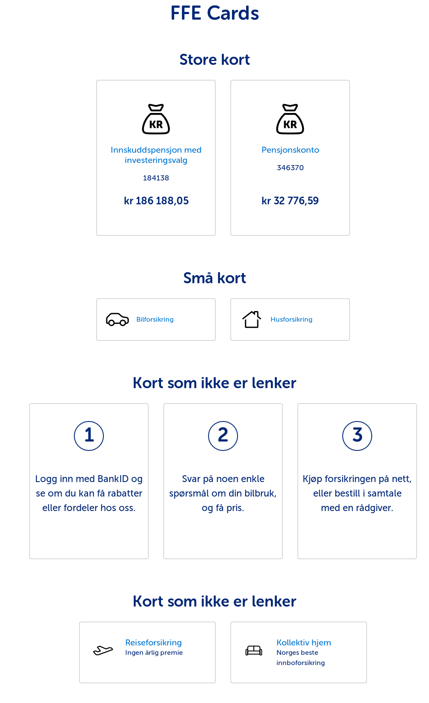

# ffe-form (Felles Frontend Form)

## Intro
Felles form-/skjemakomponentpakke for SpareBank 1. Inneholder styling for form-/skjemaelementer i FFE.


## Bruk
Modulen inneholder LESS-filer som kan importeres direkte fra node_modules til prosjektets CSS/LESS.
<code>@import ../node_modules/ffe-form/less/form.less</code> i en less-fil i ditt prosjekt.

Merk at ffe-core er en avhengighet for ffe-cards (se peerDependencies i package.json). Installer begge for å bruke ffe-form.

```sudo a
$ npm install --save-dev ffe-core ffe-form
```
ffe-form brukes på samme måte som ffe-core. Importer `ffe-form/less/form.less` for å ta i bruk alle form-komponentene.

### Import
Anbefalt er å importere gatewayfilen som i sin tur importerer alle de andre filene. Det garanterer at prosjektet ditt følger den grafiske profilen til SpareBank 1.

    @import ffe-form.less

Det er også mulig å importere enkelte filer etter behov.

    @import checkbox.less
    @import radio-button.less

### Style guide
Klargjør stilguide ved å kjøre følgende kommando:

    npm run examples

## Utvikling

For å teste endringer i en reell app lokalt kan man kjøre i dette prosjektes mappe:

```
sudo npm link
```

Og i prosjektet som skal bruke endringene gjort lokalt kan man kjøre:

```
npm link ffe-form
```

Når endringene dine er gjort må du oppdatere de visuelle regresjonstestene (se Visuell regresjonstesting).

```
./update_visual_regression_test_baseline.sh
```

Verifiser ved å kjøre testene:

```
./run_visual_regression_test.sh
```

Commit endringene med oppdaterte baselines og lag en pull request.

## Visuell regresjonstesting
Se [readme for ffe-core](https://stash.intern.sparebank1.no/projects/FFE/repos/ffe-core/browse/README.md).

## Pull Requests
Se [contribute for ffe-core](https://stash.intern.sparebank1.no/projects/FFE/repos/ffe-core/browse/CONTRIBUTE.md).

## Publisering
Se [contribute for ffe-core](https://stash.intern.sparebank1.no/projects/FFE/repos/ffe-core/browse/CONTRIBUTE.md).
